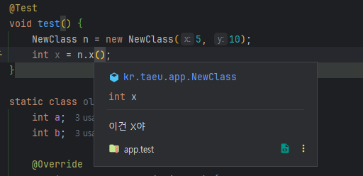

# JAVA 16 주요 변경점
## Pattern Matching for instanceof 정식 편입
JAVA 14에서 제안되었던 기능이 정식 편입되었다. Object에서 특정 클래스의 형변환 (추출)을 간결하고 안전하게 사용 가능

```java
@Test
void test() {
    Object t = "Asdf";

    // old
    if (t instanceof String) {
        String s = (String) t;
        System.out.println("s = " + s);
    }

    // new
    if (t instanceof String s) {
        System.out.println("s = " + s);
    }

    // and 조건에서는 후행조건으로 사용가능
    if (t instanceof String s && s.contains("A")) {
        System.out.println("s = " + s);
    }

    // instanceof 조건이 만족하지 않으면 후행에서 사용할 수 없으므로 or는 안됌 (flow scoping 유효)
//    if (t instanceof String s || s.length() > 5) {
//        System.out.println("s = " + s);
//    }
}
```

이를 잘 사용하면 아래와 같이 간결하게 쓸 수 있다.
```java
    static class TestClass {
        int a;
        int b;

        @Override
        public boolean equals(Object o) {
            if (!(o instanceof TestClass)) {
                return false;
            }
            TestClass t = (TestClass) o;
            return a == t.a && b == t.b;
        }
    }

    static class NewClass {
        int a;
        int b;

        @Override
        public boolean equals(Object o) {
            return (o instanceof NewClass n)
                    && a == n.a
                    && b == n.b;
        }
    }
```

## records
JAVA 14에서 처음 소개된 기능으로 정식 편입되었다.
* 반복적으로 사용하는 보일러플레이트 코드를 줄인다.
* 데이터를 명확하고 간결하게 표현한다.
* 불변 데이터 객체를 쉽게 정의할 수 있게 한다.
* 위 사항을 통해 가독성을 높히고, 데이터 구조를 간결하게 표현한다.

아래와 같은 단순한 pojo 클래스가 많으면 많을 수록 equals, hashcode와 같은 보일러플레이트 코드의 반복을 줄이고 싶은 욕망이 생긴다.
```java
static class oldClass {
    int a;
    int b;

    @Override
    public boolean equals(Object o) {
        if (this == o) return true;
        if (o == null || getClass() != o.getClass()) return false;
        oldClass oldClass = (oldClass) o;
        return a == oldClass.a && b == oldClass.b;
    }

    @Override
    public int hashCode() {
        return Objects.hash(a, b);
    }
}
```

record는 java의 새로운 형태의 class다. name, header, body의 구성요소를 가진다. header에서는 record의 속성이 나열된다.
```java
// 레코드명(header), {body}
public record NewClass(int x, int y) { }
```
* header의 각 필드를 컴포넌트라고 한다, 여기 명시된 컴포넌트에 대해 자동적으로 public accessor method와 private final field가 생성된다.
* 각 필드를 초기화하는 생성자가 생긴다(컴팩트 생성자)
* toString, equals, hashCode가 생긴다

또한 기본 구성요소 중 일부를 재정의 할 수 있다. 이렇게 생성된 생성자 아래에는 필드를 초기화하는 문구가 자동으로 추가된다.
```java
public record NewClass(int x, int y) {

    public NewClass {
        Objects.requireNonNull(x);
    }
}
```

이와 같이 명시적으로 표현할 수 있지만, equals, hashcode의 명시적 구현은 record의 불변성을 보존하도록 주의하여야 한다.

### 주의 사항
* record는 상속, 확장할 수 없다
* superclass는 항상 java.lang.record이다
* 일반 class가 Object를 명시적으로 확장할 수 있지만, record는 record superclass로 명시적 확장할 수 없다.
* 암묵적으로 final이며 abstract할 수 없다 (상속 X)
* record header만으로 record를 정의하도록 한다는 의미이다
* record field 들은 final이며, reflection으로 수정할 수 없다 (illegalAccessException 발생함)

일반 class 처럼 사용할 수 있는 부분은 다음과 같다
* new keyword로 인스턴스화
* generic 선언 가능
* static field, static method, static initializer를 포함할 수 있다.
* 컴포넌트에 대해 어노테이션을 달 수 있다. 이는 자동으로 생성된 구성요소에 전파된다.
```java
public record NewClass(@Deprecated int x, int y) {
    // private final @Deprecated int x; 와 같다

    public NewClass {
        Objects.requireNonNull(x);
    }

    static String s = "hello static";

    static {
        System.out.println("hello static initializer");
    }

    public static String getS() {
        return s;
    }
}
```


### Local record
각종 비즈니스를 처리할 때 단순한 변수 그룹 혹은 일부의 속성만 가지고 있는 객체를 다룰 때가 많다(intermediate value)
이러한 경우를 위해 지역적 record 선언을 지원한다.
```java
@Test
void localRecord() {
    record TotalSum(int a) {}

    NewClass n = new NewClass(5, 10);
    TotalSum totalSum = new TotalSum(n.x() + n.y());
    System.out.println("totalSum = " + totalSum);
}
```