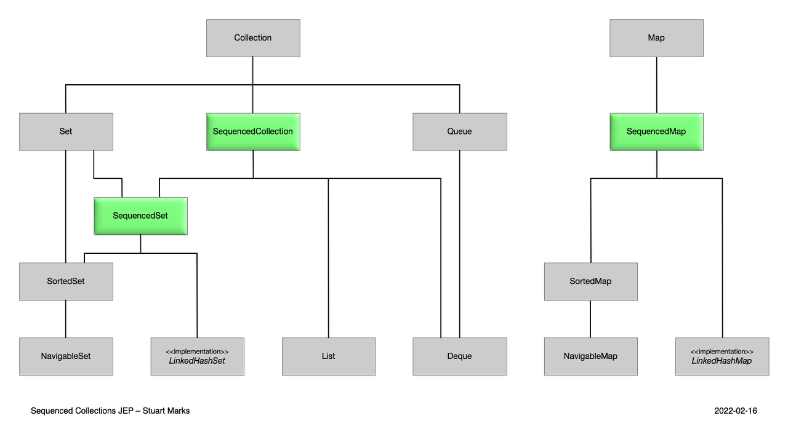
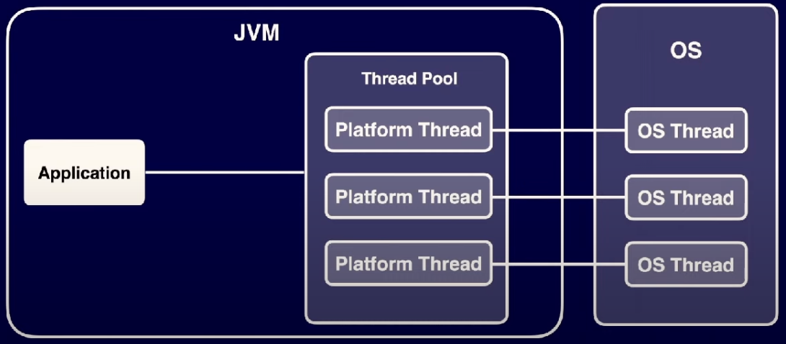
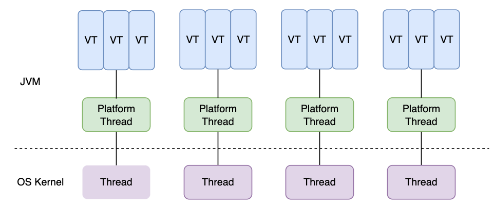

# JAVA 21 주요 변경점
## Sequenced Collections


Java 21부터는 정해진 순서의 원소를 조회할 수 있는 컬렉션을 표현하는 새로운 인터페이스를 도입한다. 
이를 통해 정해진 순서의 원소(첫 원소와 마지막 원소 등)에 접근하고, 이를 역순으로 처리하기 위한 일관된 API를 제공한다.

```java
interface SequencedCollection<E> extends Collection<E> {
    // new method
    SequencedCollection<E> reversed();
    // methods promoted from Deque
    void addFirst(E);
    void addLast(E);
    E getFirst();
    E getLast();
    E removeFirst();
    E removeLast();
}
```

추가로 제공되는 reversed()는 기존 컬렉션에서 역순으로 원소들을 처리할 수 있게 된다. 예를 들어 iterator()나 forEach(), stream(), parallelStream(), toArray() 등과 같은 기능을 역순 상태의 원소로 호출 가능해지는 것이다.
```java
@Test
void test() {
    LinkedHashSet<String> set = new LinkedHashSet<>();
    set.add("a");
    set.add("b");
    set.add("c");
    System.out.println("set = " + set);
    SequencedSet<String> reversed = set.reversed();
    System.out.println("reversed = " + reversed);
}
```

addFirst(E)와 addLast(E)는 LinkedHashSet과 같은 구현체에 특별한 의미를 갖는다. 왜냐하면 원소가 이미 존재하는 경우에 적절한 위치로 재배치되기 때문이다. 이는 요소를 재배치할 수 없다는 LinkedHashSet의 오랜 결함을 해결해준다.

## Pattern Matching for switch
JAVA 17에서 제안되었던 기능이 정식 편입되었다
```
// Prior to Java 16
if (obj instanceof String) {
    String s = (String)obj;
    ... use s ...
}

// As of Java 16
if (obj instanceof String s) {
    ... use s ...
```
위와 같이 사용하는 부분은 과거 릴리즈에서 확인되었다 하지만 기존의 스위치 문은 특정 타입 여부를 검사하는 것이 상당히 제한적이였기 때문에, 특정 타입인지 검사하려면 instance of에 if-else 문법을 사용해야 했다.
```java
// Prior to Java 21
static String formatter(Object obj) {
    String formatted = "unknown";
    if (obj instanceof Integer i) {
        formatted = String.format("int %d", i);
    } else if (obj instanceof Long l) {
        formatted = String.format("long %d", l);
    } else if (obj instanceof Double d) {
        formatted = String.format("double %f", d);
    } else if (obj instanceof String s) {
        formatted = String.format("String %s", s);
    }
    return formatted;
}
```
21에서는 다음과 같이 개선되었다.

### 특정 타입에 대한 패턴 매칭
```java
// As of Java 21
static String formatterPatternSwitch(Object obj) {
    return switch (obj) {
        case Integer i -> String.format("int %d", i);
        case Long l    -> String.format("long %d", l);
        case Double d  -> String.format("double %f", d);
        case String s  -> String.format("String %s", s);
        default        -> obj.toString();
    };
}
```

### Null 매칭
기존에 파라미터가 null이면 NPE를 던졌지만 개선되었다.
```java
// Prior to Java 21
static void testFooBarOld(String s) {
    if (s == null) {
        System.out.println("Oops!");
        return;
    }
    switch (s) {
        case "Foo", "Bar" -> System.out.println("Great");
        default           -> System.out.println("Ok");
    }
}

// As of Java 21
static void testFooBarNew(String s) {
    switch (s) {
        case null         -> System.out.println("Oops");
        case "Foo", "Bar" -> System.out.println("Great");
        default           -> System.out.println("Ok");
    }
}
```

### case 세분화
case 문은 여러 값에 대한 검사를 필요로 하기 때문에 세분화될 수 있다. 자바 21 이전에는 이러한 부분을 코드로 작성하면 상당히 복잡한 구조로 만들 수 밖에 없었다.

```java
// As of Java 21
static void testStringOld(String response) {
    switch (response) {
        case null -> { }
        case String s -> {
            if (s.equalsIgnoreCase("YES"))
                System.out.println("You got it");
            else if (s.equalsIgnoreCase("NO"))
                System.out.println("Shame");
            else
                System.out.println("Sorry?");
        }
    }
}

// As of Java 21
static void testStringNew(String response) {
    switch (response) {
        case null -> {
        }
        case String s
                when s.equalsIgnoreCase("YES") -> {
            System.out.println("You got it");
        }
        case String s
                when s.equalsIgnoreCase("NO") -> {
            System.out.println("Shame");
        }
        case String s -> {
            System.out.println("Sorry?");
        }
    }
}
```
### enum 개선
이전에는 enum type switch 구문이 상당히 제한적이다
```java
// Prior to Java 21
public enum Suit { CLUBS, DIAMONDS, HEARTS, SPADES }

static void testforHearts(Suit s) {
    switch (s) {
        case HEARTS -> System.out.println("It's a heart!");
        default -> System.out.println("Some other suit");
    }
}
```
이번에 도입된 case 문을 도입하여도 복잡도가 줄어들지 않는다.
```java
// As of Java 21
sealed interface CardClassification permits Suit, Tarot {}
public enum Suit implements CardClassification { CLUBS, DIAMONDS, HEARTS, SPADES }
final class Tarot implements CardClassification {}

static void exhaustiveSwitchWithoutEnumSupport(CardClassification c) {
    switch (c) {
        case Suit s when s == Suit.CLUBS -> {
            System.out.println("It's clubs");
        }
        case Suit s when s == Suit.DIAMONDS -> {
            System.out.println("It's diamonds");
        }
        case Suit s when s == Suit.HEARTS -> {
            System.out.println("It's hearts");
        }
        case Suit s -> {
            System.out.println("It's spades");
        }
        case Tarot t -> {
            System.out.println("It's a tarot");
        }
    }
}
```

더욱 개선하여 사용할 수 있는 방법은 다음과 같다
```java
// As of Java 21
static void exhaustiveSwitchWithBetterEnumSupport(CardClassification c) {
    switch (c) {
        case Suit.CLUBS -> {
            System.out.println("It's clubs");
        }
        case Suit.DIAMONDS -> {
            System.out.println("It's diamonds");
        }
        case Suit.HEARTS -> {
            System.out.println("It's hearts");
        }
        case Suit.SPADES -> {
            System.out.println("It's spades");
        }
        case Tarot t -> {
            System.out.println("It's a tarot");
        }
    }
}
```

## Virtual Threads
* 가상 스레드는 고성능 Java 애플리케이션에서 멀티태스킹을 관리할 수 있는 새롭고 효율적인 방법을 제공한다. 
* 기존 Java 개발에서 스레드는 여러 작업을 동시에 실행하기 위한 메커니즘이다. 
* 하지만 이러한 기존 스레드는 운영 체제에 묶여 있어 한 번에 활성화할 수 있는 스레드 수가 제한되어 있다.
* 이 제한으로 인해 더 많은 작업이나 사용자를 처리하도록 애플리케이션을 확장하기가 어렵다.


기존 스레드는 OS 스레드를 이용하는 것, 어플리케이션이 Thread pool 안에서 플랫폼 스레드를 OS 스레드와 매핑하는 것과 같다.



자바는 전체 실행 주기 동안 OS 스레드를 작아먹지 않는 java.lang.Thread 인스턴스를 도입하게 되었다.
즉, java.lang.Thread의 인스턴스로, OS 스레드와 연결되는 기존의 스레드인 플랫폼 스레드(Platform Thread)와 자바 런타임에만 존재하고 OS 스레드와는 연결되지 않는 신규 스레드인 가상 스레드(Virtual Thread)가 존재하게 되었다.

이와 맞춰 Thread API에도 변화가 있다. Thread.Builder, Thread.ofVirtual(), Thread.ofPlatform() 와 같이 신규 스레드를 생성하는 메서드가 추가되었다

```java
@Test
void platformThread() {
    Task task1 = new Task("Thread 1");
    Task task2 = new Task("Thread 2");

    Thread thread1 = Thread.ofPlatform().name("Platform Thread1").unstarted(task1);
    Thread thread2 = Thread.ofPlatform().name("Platform Thread2").unstarted(task2);

    thread1.start();
    thread2.start();

    try {
        thread1.join();
        thread2.join();
    } catch (InterruptedException e) {
        System.out.println("Main thread was interrupted while waiting.");
    }

    System.out.println("Main End");
}

static class Task implements Runnable {
    private String name;

    public Task(String name) {
        this.name = name;
    }

    @Override
    public void run() {
        for (int i = 0; i < 5; i++) {
            Thread current = Thread.currentThread();
            System.out.println(name + " is running: " + i + ", currentThread: " + current.getName() + ", isVirtual: " + current.isVirtual());
            try {
                Thread.sleep(1000); // 1초 동안 대기
            } catch (InterruptedException e) {
                System.out.println(name + " was interrupted.");
            }
        }
        System.out.println(name + " has finished.");
    }
}
```
ofPlatform() 팩토리메서드로 편하게 기존의 스레드 생성 방식을 대체할 수 있다. isVirtual 과 같은 체크메서드도 추가되어 현재 스레드가 가상인지 아닌지 확인 가능하다.

```java
@Test
void virtualThread() {
    Task task1 = new Task("Thread 1");
    Task task2 = new Task("Thread 2");

    Thread thread1 = Thread.ofVirtual().name("Virtual Thread1").unstarted(task1);
    Thread thread2 = Thread.startVirtualThread(task2);

    thread1.start();
    thread2.start();

    try {
        thread1.join();
        thread2.join();
    } catch (InterruptedException e) {
        System.out.println("Main thread was interrupted while waiting.");
    }

    System.out.println("Main End");
}
```
가상 스레드 생성 방식은 ofVirtual을 사용하거나 startVirtualThread로 Runnable을 넘겨주면 된다.

## Thread local 문제
가상 스레드는 플랫폼 스레드와 마찬가지로 ThreadLocal과 InheritableThreadLocal을 지원한다.
그러나 가상 스레드는 매우 많을 수 있으므로, 신중히 고려하여 사용해야 한다.
특히 스레드 풀의 한 스레드가 여러 작업을 위해 비싼 리소스를 풀링하는 경우에 스레드 로컬을 사용하지 않아야 한다.
따라서 JDK의 기본 모듈에서도 가상 스레드를 위해 스레드 로컬을 사용하는 코드들을 많이 제거함으로써 수백만 개의 스레드가 실행될 때 메모리 공간을 줄였다.

## 대안
스레드 로컬은 현재 스레드의 실행과 연관된 데이터들을 다루는 기법으로 캐싱, 파라미터 숨기기 등 다양한 목적으로 사용되고 있다. 하지만 스레드 로컬은 현실적으로 다음과 같은 문제를 갖고 있고, 이로 인해 메모리 누수나 메모리 에러 등이 발생할 수 있다.
* 명확한 생명주기가 없음(unbounded lifetime)
* 변경 가능성에 대해서 제약이 없음(unconstrained mutability)
* 메모리 사용에 대해서 제약이 없음(unconstrained memory usage)
* 값비싼 상속 기능을 사용하는 InheritableThreadLocal의 성능 문제

기존의 스레드 로컬을 보완하기 위한 Scoped Values 라는 기능이 JEP-446 스펙으로 진행중이다. Scoped Values는 메서드 파라미터를 사용하지 않고 안전하고 효과적으로 메서드에 값을 전달할 수 있도록 한다. 이를 통해 스레드 로컬로 인한 문제를 최대한 예방할 수 있도록 지원할 것으로 보인다.